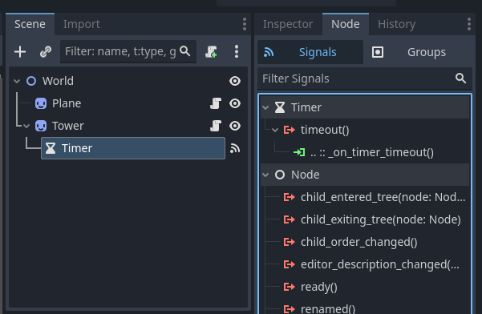

# Tower defense LTT

video source: https://youtu.be/W8gYHTjDCic

assets: 
- https://github.com/ETdoFresh/kenney.nl/tree/master/tower-defense-top-down
- https://kenney.nl/assets/tower-defense-top-down

godot: https://godotengine.org/

## The setup

plane.gd

```gdscript
extends Sprite2D

func _process(delta: float) -> void:
    global_position += Vector2(-200 * delta, 0)
```

tower.gd

```gdscript
extends Sprite2D

@onready var missile := %Missile

func _process(delta: float) -> void:
    missile.global_position += Vector2(400 * delta, 0)
```

### Collision?

tower.gd

```gdscript
extends Sprite2D

@onready var missile := %Missile
@onready var plane: Sprite2D = $"../Plane"

func _process(delta: float) -> void:
    if not is_instance_valid(missile):
        return

    missile.global_position += Vector2(400 * delta, 0)

    if missile.global_position.distance_to(plane.global_position) < 20:
        missile.queue_free()
        plane.queue_free()
```

## Defining components

Découplons la tour et le missile en lui donnant son propre script.

missile.gd

```gdscript
extends Sprite2D
@export var speed: float = 400

func _process(delta: float) -> void:
    global_position += Vector2(speed * delta, 0)
```

And remove the code from the tower.

## Creating components at runtime

Clic droit sur Missile `Save branch as scene` > missile.tscn

tower.gd

```gdscript
extends Sprite2D

func _ready() -> void:
    var missile_scene := preload("res://missile.tscn")
    var missile       := missile_scene.instantiate()
    add_child(missile)
```

## Signals

Ajouter un timer a la tour.

tower

```gdscript
func _on_timer_timeout() -> void:
    var missile_scene := preload("res://missile.tscn")
    var missile       := missile_scene.instantiate()
    add_child(missile)
```

On peut appeler cette méthode soit via code:

```gdscript
func _on_timer_timeout() -> void:
    var missile_scene := preload("res://missile.tscn")
    var missile       := missile_scene.instantiate()
    add_child(missile)
```

soit via l'UI:



Ne pas oublier de reset la position et la rotation du missile dans sa scène pour qu'il hérite de celle de son parent.

## Detection avec les Areas

- Ajouter une Area2d avec une collisionShape au missile
- Créer un CharacterBody2D pour l'avion avec une collisionShape
- connecter le signal body_entered de l'area2d du missile et afficher le résultat

Est-ce que ça fonctionne?
Utiliser la fonction de debug des collisions de godot pour voir un problème éventuel

Refactorer le Plane pour utiliser `velocity` et `move_and_slide()`

## Contracts

- ajouter une méthode `take_damage()` au plane
- l'appeler dans le body_entered du missile (if has_method)
- ajouter des domages configurables au missile et une healthbar au Plane avec une `ProgressBar`

## Réutilisation des composants

- Créer un marker2D 'Spawner' avec une méthode `spanw()` qui crée un Plane
- Ajouter des attributs configurabes interval_min, interval_max
- get_tree().create_timer(randf_range(...)).timeout.connect(spawn)
- crée un deuxième type d'avion plus gros, avec plus d'HP et moins de vitesse, en réutilisant le script plane.gd
- rendre les objets spawnés configurables `@export var items:Array[PackedScene] = []`
- Changer le collision mask des Planes pour éviter les collisions entre eux

## Détection des collisions avec move_and_slide()

- tower => staticBody2D
    - Add a collission Shape
    - Helthbar
- plane => utiliser get_slide_collision_count() et get_slide_collision() pour trouver si le plane collisionne avec un
  truc

## Groups

- appeler la méthode `take_damage()` si elle existe sur les objets collisionnant avec le Plane
- ajouter une méthode take_damage et une healthbar à la tower
- Oh Oh les missiles colissionent avec la tower
- On peut ajouter les collision mask et/ou mettre la tower/les plane dans des groups (friendlies/enemies)
- détruire le plane quand il collisionne pour éviter de one shot la tower

## Combiner des composants

- Fish detector (Aread2d) derrière la tour
- Créer une UI dans un CanvasLayer avec un label qui compte le nombre d'avions passés (attacher le script au root node Main)

## Autoloads

- Ajouter un Label score
- Ajouter un script point_couter.gd et l'ajouter en autoload avec une méthode `count_points()`
- Appeler cette méthode quand la santé d'un avion tombe à zéro ou quand il colissionne avec la tour

## Signals

- Créer un custom signal dans le point counter (`signal point_counted()`)
- Connecter game.gd à ce signal

## Signal relays

Maintenant tout le monde est couplé à l'autoload :'(
Il existe un composant qui connait tous les avions: le spawer. On peut l'utiliser comme relai

- Ajouter un signal `plane_destroyed` au plane et l'appeler quand l'avion est détruit
- Ajouter un signal `plane_destroyed` au spawner pour relayer celui des avions
- On peut maintenant connecter le signal du spawner au main.gd via l'UI directment
- supprimer l'autoload

## Accéder aux composants via les groups

- Ajouter un Label "Game over"
- quand vie = 0 => show
- créer un group "destroy_on_game_over"
- Ajouter à ce groupe: les avions, la tour, et le spawner
- quand le jeu est over => itérer sur toutes les instances `get_tree().get_nodes_in_group()` et queue_free()

## Call propagation

Replacer le group "destroy_on_game_over" avec `propagate_call("on_game_over")`

## Configurer les NodePaths

Quand on détruit la tour, on détruit également ses enfants (missiles)
Si on veut garder les projectiles visibles à la fin du jeu, il faut les faire spawner dans un autre parent


- Ajouter une var export à la tour de type NodePath
- On peut le trouver avec get_node(node_path) et l'utiliser pour add_child() les missiles
- ne pas oublier d'hériter de la transform de la tour!

get_parent() ?

